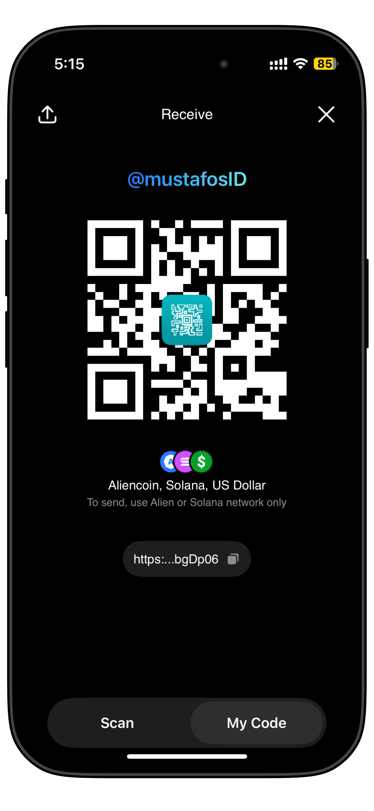
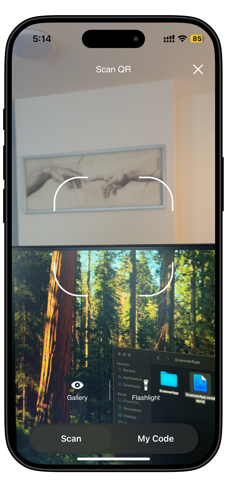

# 🔍 QRFusion

**QRFusion** is a modern QR code scanning and sharing app built with **SwiftUI** and **The Composable Architecture (TCA)**. It offers a seamless experience for scanning QR codes via camera, extracting them from the gallery, and displaying your own wallet address as a custom-branded QR code.

<p align="center">
<a href="https://github.com/mustafos/QRFusion.git" target="_blank"></a>
<i>📷 Live camera scan · 🖼 Gallery import · 🎨 Custom QR with logo · 📤 Share & copy · ⚙️ Built with TCA</i>
</p>

---

## ✨ Features

- 📷 **Live camera scanning** using `AVFoundation`
- 🖼️ **Scan from gallery** with `PHPicker` + `Vision`
- 🔲 **Custom QR generation** with color, logo overlay & rounded modules
- 🟨 **Highlight detected QR code** with animated yellow frame
- 📤 **Export QR as image** with `ShareLink`
- 🌐 **Reactive state management** via TCA
- 💡 **Flashlight control** during scanning
- 🔒 **Privacy-first design**: no tracking, no analytics

---

## 🧠 Architecture

QRFusion is built with [**The Composable Architecture (TCA)**](https://github.com/pointfreeco/swift-composable-architecture), using a modular and scalable approach:

### Main Modules
```
AppFeature
├── ScanFeature // Handles camera scanning and QR recognition
├── PreviewFeature // Shows user's wallet QR code with share/copy
└── CameraService // Manages AVCaptureSession, metadata, flashlight
```
- ✅ `@Reducer` and `@CasePathable` for feature boundaries
- 📦 `@PresentationState` for sheets and modals
- 📸 `AVCaptureSession` with live preview and QR metadata detection
- 🧠 `Vision` framework for barcode detection in gallery images
- 🧬 `CoreImage` for custom QR code rendering

---

## 📱 Screenshots

| Scan QR | Wallet QR Preview |
|---------|-------------------|
|  |  |

---

## 🧪 Tech Stack

- Swift 5.9+
- iOS 17+
- Xcode 15+
- SwiftUI
- ComposableArchitecture
- AVFoundation
- Vision
- CoreImage
- PhotosUI

---

## 📦 Installation

```bash
git clone https://github.com/mustafos/QRFusion.git
cd ScannerApp
open ScannerApp.xcodeproj
```

> 🚨 Note: Camera features require a real device. Simulator won't work for scanning.

## **🧾 License**
This project is licensed under the MIT License — see the [LICENSE](https://github.com/mustafos/QRFusion/blob/master/LICENSE) file for details.
